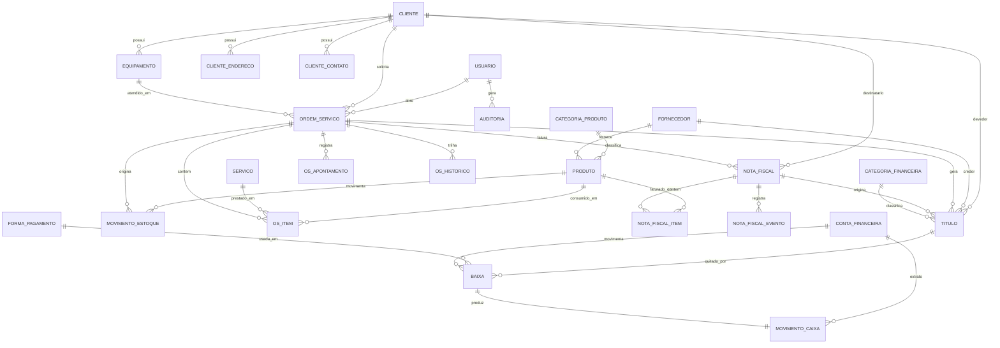

# 02 — Modelo de Dados

Banco: **PostgreSQL 16**. ORM: **Prisma**.
Convenções: tabelas `snake_case` no plural, PK `id` (`uuid v7`), toda tabela tem
`criado_em`, `atualizado_em` e (quando aplicável) `criado_por_id`.
Dinheiro: `NUMERIC(14,2)`. Quantidade: `NUMERIC(14,3)`. Percentual: `NUMERIC(7,4)`.

---

## 1. ERD — visão geral

---

## 2. Módulo transversal

### `usuarios`

| Campo | Tipo | Notas |
|---|---|---|
| id | uuid | PK |
| nome | varchar(120) | |
| email | citext | **único** |
| senha_hash | text | Argon2id |
| papel | enum | `ADMIN`, `ATENDENTE`, `TECNICO`, `FINANCEIRO`, `ESTOQUE` |
| ativo | boolean | default `true` |
| ultimo_login_em | timestamptz | |

### `usuario_permissoes`

Permissões aditivas concedidas pontualmente além do papel (doc 09).
`id`, `usuario_id` (FK), `permissao` (varchar, ex. `estoque:entrada`), `concedida_por_id`, `criado_em`.

### `refresh_tokens`

`id`, `usuario_id` (FK), `token_hash`, `familia_id`, `expira_em`, `revogado_em`, `ip`, `user_agent`.
Rotação e detecção de reúso conforme doc 09.

### `auditoria`

Toda escrita relevante grava aqui. Tabela append-only.

| Campo | Tipo | Notas |
|---|---|---|
| id | uuid | PK |
| usuario_id | uuid | FK, nullable (ações do sistema) |
| entidade | varchar(60) | ex. `ordem_servico` |
| entidade_id | uuid | |
| acao | varchar(40) | `CRIAR`, `ATUALIZAR`, `CANCELAR`, `MUDAR_STATUS`, … |
| dados_antes | jsonb | |
| dados_depois | jsonb | |
| ip / user_agent | inet / text | |
| criado_em | timestamptz | |

### `parametros`

Chave-valor para configuração da empresa (dados do emitente, numeração de OS, alíquotas
padrão, prazo default de garantia). Evita hardcode e migration para mudar uma alíquota.

---

## 3. Módulo Clientes

### `clientes`

| Campo | Tipo | Notas |
|---|---|---|
| id | uuid | PK |
| codigo | serial | Número curto para uso humano |
| tipo_pessoa | enum | `FISICA`, `JURIDICA` |
| nome | varchar(150) | Nome ou razão social |
| nome_fantasia | varchar(150) | Só PJ |
| documento | varchar(14) | CPF ou CNPJ, só dígitos. **Único** (parcial, onde `ativo = true`) |
| inscricao_estadual | varchar(20) | `ISENTO` permitido |
| inscricao_municipal | varchar(20) | |
| email | citext | |
| telefone / celular | varchar(20) | |
| observacoes | text | |
| limite_credito | numeric(14,2) | default 0 = sem limite |
| bloqueado | boolean | Bloqueia nova OS/venda |
| motivo_bloqueio | text | Obrigatório quando `bloqueado = true` |
| documento_pendente | boolean | `true` quando cadastrado sem CPF/CNPJ (RN-CLI-02) — impede emissão de NF |
| ativo | boolean | Soft delete |

**Regras:** CPF/CNPJ validado por dígito verificador; documento normalizado (sem máscara)
na persistência; unicidade de documento entre clientes ativos.

### `cliente_enderecos`

`id`, `cliente_id` (FK), `tipo` (`PRINCIPAL`, `COBRANCA`, `ENTREGA`), `cep`, `logradouro`,
`numero`, `complemento`, `bairro`, `cidade`, `uf`, `codigo_ibge`, `principal` (boolean).
Um único endereço `principal = true` por cliente (índice único parcial).

### `cliente_contatos`

`id`, `cliente_id`, `nome`, `cargo`, `email`, `telefone`, `principal`.

### `equipamentos`

Objeto do cliente que entra em manutenção. Torna o histórico por equipamento possível.

`id`, `cliente_id` (FK), `tipo` (varchar), `marca`, `modelo`, `numero_serie`,
`identificador` (patrimônio/placa), `acessorios` (text), `observacoes`,
`substitui_id` (FK auto-relacionada — equipamento anterior, RN-CLI-10), `ativo`.
Índice em (`cliente_id`, `numero_serie`).

---

## 4. Módulo Estoque

### `categorias_produto`
`id`, `nome`, `pai_id` (auto-relacionamento, opcional), `ativo`.

### `fornecedores`
Mesma estrutura essencial de `clientes` (PF/PJ, documento, contato, endereço), separada
porque o ciclo de vida e as permissões são diferentes.

### `produtos`

| Campo | Tipo | Notas |
|---|---|---|
| id | uuid | PK |
| sku | varchar(40) | **Único** |
| codigo_barras | varchar(20) | EAN, opcional |
| descricao | varchar(200) | |
| categoria_id / fornecedor_padrao_id | uuid | FK |
| unidade | varchar(6) | `UN`, `PC`, `MT`, `KG`… |
| tipo | enum | `PECA`, `INSUMO`, `REVENDA` |
| preco_custo_medio | numeric(14,4) | **Derivado** — recalculado a cada entrada |
| preco_venda | numeric(14,2) | |
| margem_padrao | numeric(7,4) | |
| saldo | numeric(14,3) | **Derivado** dos movimentos (cache) |
| saldo_reservado | numeric(14,3) | Comprometido com OS aprovadas |
| estoque_minimo / estoque_maximo | numeric(14,3) | |
| localizacao | varchar(40) | Prateleira/gaveta |
| ncm / cfop_padrao / cest | varchar | Dados fiscais |
| origem_fiscal | smallint | 0–8 (tabela da SEFAZ) |
| controla_estoque | boolean | `false` para serviços cadastrados como produto |
| permite_negativo | boolean | Exceção à RN-EST-02; default `false` |
| ativo | boolean | |

> `saldo_disponivel = saldo - saldo_reservado` (campo calculado, não persistido).

### `movimentos_estoque` — o livro-razão

Append-only. **Nunca** é editado ou apagado; erro se corrige com movimento de ajuste.

| Campo | Tipo | Notas |
|---|---|---|
| id | uuid | PK |
| produto_id | uuid | FK |
| tipo | enum | `ENTRADA`, `SAIDA`, `AJUSTE_POSITIVO`, `AJUSTE_NEGATIVO`, `DEVOLUCAO`, `PERDA`, `TRANSFERENCIA` |
| origem | enum | `COMPRA`, `ORDEM_SERVICO`, `VENDA`, `INVENTARIO`, `MANUAL`, `DEVOLUCAO_CLIENTE` |
| origem_id | uuid | ID da OS / NF / inventário que originou |
| quantidade | numeric(14,3) | Sempre positiva; o sinal vem do `tipo` |
| custo_unitario | numeric(14,4) | Obrigatório em entradas |
| saldo_apos | numeric(14,3) | Snapshot para auditoria e conferência |
| custo_medio_apos | numeric(14,4) | Snapshot |
| documento | varchar(60) | Nº da NF de compra, por exemplo |
| motivo | text | Obrigatório em ajustes e perdas |
| usuario_id | uuid | FK |
| criado_em | timestamptz | |

Índices: (`produto_id`, `criado_em`), (`origem`, `origem_id`).

### `reservas_estoque`
`id`, `produto_id`, `ordem_servico_id`, `quantidade`, `status` (`ATIVA`, `CONSUMIDA`, `LIBERADA`), `criado_em`.

### `inventarios` / `inventario_itens`
Contagem periódica. `inventarios`: `id`, `data`, `status` (`ABERTO`, `FECHADO`), `responsavel_id`.
`inventario_itens`: `produto_id`, `saldo_sistema`, `saldo_contado`, `diferenca`, `movimento_gerado_id`.

---

## 5. Módulo Ordem de Serviço

### `servicos`
Catálogo de mão de obra: `id`, `codigo`, `descricao`, `preco`, `tempo_estimado_min`,
`codigo_servico_municipal` (para NFS-e), `aliquota_iss`, `ativo`.

### `ordens_servico`

| Campo | Tipo | Notas |
|---|---|---|
| id | uuid | PK |
| numero | serial | Sequencial visível, único |
| cliente_id / equipamento_id | uuid | FK (equipamento opcional) |
| tecnico_id / aberta_por_id | uuid | FK `usuarios` |
| status | enum | ver máquina de estados (doc 05) |
| prioridade | enum | `BAIXA`, `NORMAL`, `ALTA`, `URGENTE` |
| tipo | enum | `MANUTENCAO`, `INSTALACAO`, `GARANTIA`, `ORCAMENTO` |
| descricao_problema | text | Relato do cliente |
| diagnostico | text | Técnico |
| solucao | text | O que foi feito |
| valor_produtos | numeric(14,2) | **Derivado** dos itens |
| valor_servicos | numeric(14,2) | **Derivado** dos itens |
| desconto | numeric(14,2) | |
| acrescimo | numeric(14,2) | |
| valor_total | numeric(14,2) | `produtos + servicos + acrescimo - desconto` |
| garantia_dias | integer | |
| previsao_entrega | timestamptz | |
| aprovada_em / aprovada_por | timestamptz / varchar | Quem do lado do cliente aprovou |
| finalizada_em / cancelada_em | timestamptz | |
| motivo_cancelamento | text | |
| os_origem_id | uuid | FK auto-relacionada — OS original, quando `tipo = GARANTIA` (RN-OS-11) |
| observacoes_internas | text | Não sai na impressão do cliente |

### `os_itens`

| Campo | Tipo | Notas |
|---|---|---|
| id | uuid | PK |
| ordem_servico_id | uuid | FK, `ON DELETE CASCADE` |
| tipo | enum | `PRODUTO`, `SERVICO` |
| produto_id / servico_id | uuid | FK, exclusivos (CHECK) |
| descricao | varchar(200) | Snapshot da descrição no momento |
| quantidade | numeric(14,3) | |
| preco_unitario | numeric(14,2) | Snapshot |
| desconto | numeric(14,2) | |
| valor_total | numeric(14,2) | |
| custo_unitario | numeric(14,4) | Snapshot do custo médio — base da margem |
| baixado_estoque | boolean | |

> **Snapshot de preço**: mudar o preço do produto no cadastro **não** altera OS já lançadas.

### `os_apontamentos`
Horas trabalhadas: `id`, `ordem_servico_id`, `tecnico_id`, `inicio`, `fim`, `descricao`, `faturavel`.

### `os_historico`
Trilha de status: `id`, `ordem_servico_id`, `status_anterior`, `status_novo`, `usuario_id`, `observacao`, `criado_em`.

### `os_anexos`
Fotos do equipamento, laudos: `id`, `ordem_servico_id`, `nome`, `caminho`, `mime`, `tamanho`, `usuario_id`.

---

## 6. Módulo Notas Fiscais

### `notas_fiscais`

| Campo | Tipo | Notas |
|---|---|---|
| id | uuid | PK |
| tipo | enum | `NFE` (produto, mod. 55), `NFSE` (serviço), `NFCE` (consumidor) |
| finalidade | enum | `NORMAL`, `COMPLEMENTAR`, `AJUSTE`, `DEVOLUCAO` |
| operacao | enum | `SAIDA`, `ENTRADA` |
| numero / serie | integer | Preenchidos após autorização |
| chave_acesso | char(44) | Único quando não nulo |
| status | enum | ver doc 06 |
| cliente_id | uuid | FK (destinatário) |
| ordem_servico_id | uuid | FK opcional |
| natureza_operacao | varchar(60) | ex. "Prestação de serviço" |
| data_emissao / data_autorizacao | timestamptz | |
| valor_produtos / valor_servicos / valor_desconto / valor_frete | numeric(14,2) | |
| valor_total | numeric(14,2) | |
| base_icms / valor_icms / valor_ipi / valor_pis / valor_cofins / valor_iss | numeric(14,2) | |
| provedor | varchar(30) | Qual implementação emitiu |
| provedor_ref | varchar(80) | ID da nota no provedor (idempotência) |
| protocolo | varchar(30) | Protocolo de autorização |
| motivo_rejeicao | text | |
| xml_caminho / pdf_caminho | text | Armazenamento imutável |
| payload_envio / payload_retorno | jsonb | Diagnóstico |
| cancelada_em / motivo_cancelamento | timestamptz / text | |

### `nota_fiscal_itens`
`id`, `nota_fiscal_id`, `numero_item`, `produto_id`/`servico_id`, `descricao`, `ncm`, `cfop`,
`cst_icms`, `unidade`, `quantidade`, `valor_unitario`, `valor_total`, `valor_desconto`,
`base_icms`, `aliquota_icms`, `valor_icms`, `aliquota_iss`, `valor_iss`.

### `nota_fiscal_eventos`
`id`, `nota_fiscal_id`, `tipo` (`ENVIO`, `AUTORIZACAO`, `REJEICAO`, `CANCELAMENTO`, `CARTA_CORRECAO`),
`protocolo`, `mensagem`, `payload` (jsonb), `criado_em`.

---

## 7. Módulo Financeiro

### `categorias_financeiras`
Plano de contas simplificado: `id`, `nome`, `tipo` (`RECEITA`, `DESPESA`), `pai_id`, `ativo`.
Ex.: Receita → Serviços, Venda de peças. Despesa → Fornecedores, Aluguel, Folha, Impostos.

### `contas_financeiras`
Caixa e bancos: `id`, `nome`, `tipo` (`CAIXA`, `BANCO`, `CARTAO`), `banco`, `agencia`, `conta`,
`saldo_inicial`, `saldo_atual` (derivado), `ativo`.

### `formas_pagamento`
`id`, `nome` (Dinheiro, Pix, Débito, Crédito, Boleto, Transferência), `tipo`,
`prazo_compensacao_dias`, `taxa_percentual`, `conta_padrao_id`, `ativo`.

### `titulos`

Uma linha = **uma parcela**.

| Campo | Tipo | Notas |
|---|---|---|
| id | uuid | PK |
| tipo | enum | `RECEBER`, `PAGAR` |
| numero | varchar(30) | ex. `OS-1042/2` |
| cliente_id / fornecedor_id | uuid | FK, exclusivos por tipo (CHECK) |
| ordem_servico_id / nota_fiscal_id | uuid | FK opcionais (origem) |
| categoria_id | uuid | FK |
| descricao | varchar(200) | |
| parcela / total_parcelas | smallint | |
| valor_original | numeric(14,2) | |
| valor_desconto / valor_juros / valor_multa | numeric(14,2) | |
| valor_pago | numeric(14,2) | **Derivado** das baixas |
| valor_saldo | numeric(14,2) | **Derivado** |
| data_emissao / data_vencimento / data_competencia | date | |
| status | enum | `ABERTO`, `PARCIAL`, `PAGO`, `VENCIDO`, `CANCELADO`, `RENEGOCIADO` |
| forma_pagamento_id | uuid | Prevista |
| titulo_origem_id | uuid | FK auto-relacionada — título renegociado que originou este (RN-FIN-14) |
| motivo_cancelamento | text | Obrigatório em `CANCELADO` |
| observacoes | text | |

Índices: (`tipo`, `status`, `data_vencimento`), (`cliente_id`), (`ordem_servico_id`).

### `baixas`
`id`, `titulo_id` (FK), `data_pagamento`, `valor`, `juros`, `multa`, `desconto`,
`forma_pagamento_id`, `conta_financeira_id`, `observacao`, `usuario_id`, `estornada_em`,
`motivo_estorno`. Uma baixa nunca é editada — corrige-se com estorno.

### `movimentos_caixa`
Extrato derivado: `id`, `conta_financeira_id`, `tipo` (`CREDITO`, `DEBITO`), `valor`,
`data`, `origem` (`BAIXA`, `TRANSFERENCIA`, `AJUSTE`), `origem_id`, `saldo_apos`, `descricao`.

---

## 8. Invariantes do banco (garantidas por CHECK / índice / trigger)

| # | Invariante |
|---|---|
| I1 | `os_itens`: exatamente um de (`produto_id`, `servico_id`) preenchido |
| I2 | `titulos`: `RECEBER` exige `cliente_id`; `PAGAR` exige `fornecedor_id` |
| I3 | `movimentos_estoque` é append-only (sem `UPDATE`/`DELETE` — revogado no papel da aplicação) |
| I4 | `produtos.saldo` deve ser igual à soma assinada dos movimentos (job de conferência diário) |
| I5 | `titulos.valor_pago` = soma das baixas não estornadas |
| I6 | `clientes.documento` único entre registros ativos |
| I7 | Só um `cliente_enderecos.principal = true` por cliente |
| I8 | `notas_fiscais.chave_acesso` única quando não nula |
| I9 | Nenhuma OS pode ir para `FINALIZADA` com item de produto sem baixa de estoque |
| I10 | `baixas.valor` ≤ `titulos.valor_saldo` no momento da baixa (validado em transação) |

## 9. Estratégia de migrations e seed

- Toda mudança de schema é uma migration Prisma versionada e revisada em PR. Nunca `db push` em staging/produção.
- Migration destrutiva (drop de coluna com dados) exige duas etapas: deprecar → migrar dados → remover.
- **Seed de desenvolvimento**: usuário admin, papéis, categorias financeiras e de produto padrão, formas de pagamento, conta caixa, ~20 produtos, ~10 clientes, ~15 OS em estados variados. Isso torna o front desenvolvível no dia 1.
