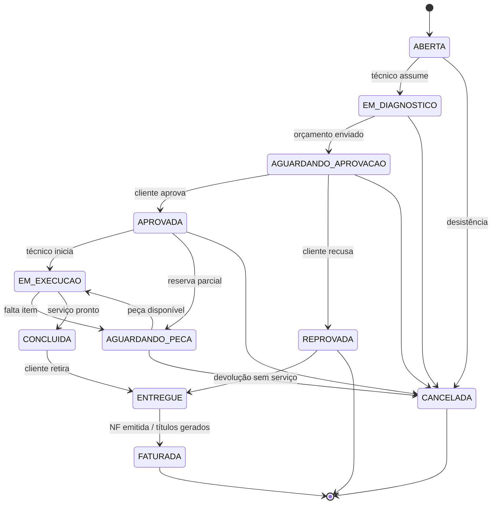

# 05 — Módulo Ordem de Serviço

A OS é o **documento central** do sistema: ela puxa o cliente, consome o estoque, origina a
nota fiscal e gera o financeiro. Todo o resto orbita em torno dela.

## 1. Máquina de estados



### Transições permitidas

| De | Para | Quem | Pré-condições |
|---|---|---|---|
| — | `ABERTA` | ATENDENTE, ADMIN | Cliente ativo e não bloqueado |
| `ABERTA` | `EM_DIAGNOSTICO` | TECNICO, ADMIN | Técnico atribuído |
| `EM_DIAGNOSTICO` | `AGUARDANDO_APROVACAO` | TECNICO, ADMIN | Diagnóstico preenchido e ≥ 1 item lançado |
| `AGUARDANDO_APROVACAO` | `APROVADA` | ATENDENTE, ADMIN | Nome de quem aprovou + canal (presencial/telefone/WhatsApp) |
| `APROVADA` | `EM_EXECUCAO` | TECNICO, ADMIN | Todas as peças reservadas com sucesso |
| `APROVADA` | `AGUARDANDO_PECA` | Sistema | Reserva parcial na aprovação (RN-OS-06) |
| `EM_EXECUCAO` | `AGUARDANDO_PECA` | TECNICO, ADMIN | Item indisponível durante a execução |
| `AGUARDANDO_PECA` | `EM_EXECUCAO` | TECNICO, ADMIN | Peças pendentes agora disponíveis e reservadas |
| `EM_EXECUCAO` | `CONCLUIDA` | TECNICO, ADMIN | Solução preenchida e todos os itens de produto baixados |
| `CONCLUIDA` | `ENTREGUE` | ATENDENTE, ADMIN | — |
| `ENTREGUE` | `FATURADA` | FINANCEIRO, ADMIN | Títulos gerados (NF opcional conforme decisão P1) |
| qualquer¹ | `CANCELADA` | ADMIN (ou ATENDENTE antes de `APROVADA`) | Motivo obrigatório |

¹ Exceto `FATURADA` — nota emitida e títulos gerados exigem **estorno**, não cancelamento
simples (ver RN-OS-10).

## 2. Casos de uso

| ID | Caso de uso | Papéis |
|---|---|---|
| OS-01 | Abrir OS (cliente, equipamento, problema) | ATENDENTE, ADMIN |
| OS-02 | Atribuir/trocar técnico | ADMIN, ATENDENTE |
| OS-03 | Registrar diagnóstico | TECNICO, ADMIN |
| OS-04 | Adicionar/remover itens (peças e serviços) | TECNICO, ATENDENTE, ADMIN |
| OS-05 | Aplicar desconto | ADMIN (acima do limite), ATENDENTE (até o limite) |
| OS-06 | Gerar PDF do orçamento | ATENDENTE, TECNICO, ADMIN |
| OS-07 | Registrar aprovação/reprovação do cliente | ATENDENTE, ADMIN |
| OS-08 | Apontar horas trabalhadas | TECNICO |
| OS-09 | Anexar fotos e laudos | TECNICO, ATENDENTE |
| OS-10 | Concluir e entregar | TECNICO / ATENDENTE |
| OS-11 | Faturar (NF + títulos) | FINANCEIRO, ADMIN |
| OS-12 | Cancelar com motivo | ADMIN |
| OS-13 | Ver painel de OS (kanban por status) | Todos |
| OS-14 | Consultar margem da OS | ADMIN, FINANCEIRO |
| OS-15 | Reabrir por garantia (nova OS vinculada) | ATENDENTE, ADMIN |

## 3. Regras de negócio

**RN-OS-01 — Numeração.** Sequencial, gerada por `SEQUENCE` do Postgres, sem buracos e sem
reaproveitamento. Formato exibido: `OS-000123`.

**RN-OS-02 — Cálculo do total.** Sempre derivado, nunca digitado:

```
valor_produtos = Σ (item.quantidade × item.preco_unitario − item.desconto)  [tipo = PRODUTO]
valor_servicos = Σ (item.quantidade × item.preco_unitario − item.desconto)  [tipo = SERVICO]
valor_total    = valor_produtos + valor_servicos + acrescimo − desconto
```

Recalculado a cada alteração de item, dentro da transação.

**RN-OS-03 — Snapshot de preço e custo.** Ao adicionar um item, copiam-se `preco_venda` e
`preco_custo_medio` do produto para a linha. Mudança posterior no cadastro não altera OS
existentes — é isso que torna o relatório de margem histórico confiável.

**RN-OS-04 — Itens travam após aprovação.** Depois de `APROVADA`, alterar itens exige
permissão de ADMIN e volta a OS para `AGUARDANDO_APROVACAO` (nova aprovação do cliente).
O cliente não pode ser surpreendido com um valor diferente do que aprovou.

**RN-OS-05 — Limite de desconto.** `parametros.desconto_maximo_atendente` (default 10%).
Acima disso, exige aprovação de ADMIN, registrada em auditoria com o percentual concedido.

**RN-OS-06 — Reserva na aprovação.** Ao aprovar, cada item de produto tenta reservar no
estoque. Se algum item não tem disponível, a OS é aprovada mesmo assim, mas entra em
`AGUARDANDO_PECA` e o item fica marcado como pendente — o processo comercial não trava por
falta de peça, mas a falta fica visível.

**RN-OS-07 — Baixa na conclusão.** Ao mover para `CONCLUIDA`, todos os itens de produto
ainda não baixados geram movimento de saída (`origem = ORDEM_SERVICO`). Se algum falhar, a
transação inteira é revertida e a OS permanece em `EM_EXECUCAO`.

**RN-OS-08 — Faturamento.** Ao faturar:
1. Emite NF conforme a composição da OS (produtos → NF-e, serviços → NFS-e; ver doc 06).
2. Gera os títulos a receber conforme a condição de pagamento escolhida.
3. Ambos na mesma transação. A emissão fiscal, sendo chamada externa, é feita **após** o
   commit, via job — a OS fica `FATURADA` com a NF em `PROCESSANDO`.

**RN-OS-09 — Cancelamento.** Exige motivo (≥ 10 caracteres). Efeitos: libera reservas,
estorna baixas com movimento de devolução, cancela títulos ainda `ABERTO`. Títulos com
baixa exigem estorno manual pelo financeiro — o sistema bloqueia e explica.

**RN-OS-10 — OS faturada não cancela.** Precisa de: cancelamento/inutilização da NF (prazo
legal) + estorno dos títulos. Fluxo assistido, sempre por ADMIN, com trilha completa.

**RN-OS-11 — Garantia.** OS finalizada define `garantia_dias` (default
`parametros.garantia_padrao_dias`, 90). Ao abrir nova OS para o mesmo equipamento dentro do
prazo, o sistema sugere `tipo = GARANTIA`, que zera o valor dos serviços por padrão e
vincula a OS original (`os_origem_id`).

**RN-OS-12 — Margem.** `margem = valor_total − Σ (item.quantidade × item.custo_unitario)`.
Visível apenas para ADMIN e FINANCEIRO. Nunca aparece em documento entregue ao cliente.

**RN-OS-13 — Um técnico por OS, vários apontamentos.** O responsável é um só
(`tecnico_id`), mas qualquer técnico pode lançar horas em `os_apontamentos`.

**RN-OS-14 — Prazo.** `previsao_entrega` é obrigatória a partir de `APROVADA`. OS com
previsão vencida e status diferente de `CONCLUIDA`/`ENTREGUE` aparece destacada no painel.

## 4. Painel de OS (kanban)

Colunas = status. Cada card mostra: número, cliente, equipamento, técnico, valor, previsão,
e ícones de alerta (atrasada, aguardando peça, aguardando aprovação há > 48h).
Filtros: técnico, período, status, cliente, prioridade.

## 5. Documentos gerados

| Documento | Quando | Conteúdo |
|---|---|---|
| **Comprovante de entrada** | Na abertura | Dados do cliente, equipamento, problema relatado, acessórios entregues, previsão |
| **Orçamento** | Em `AGUARDANDO_APROVACAO` | Itens, valores, prazo de validade, campo de aceite |
| **OS de execução** | Em `APROVADA` | Versão interna com custos e observações internas |
| **Comprovante de entrega** | Em `ENTREGUE` | Solução aplicada, itens trocados, garantia, assinatura |

Todos em PDF A4 (premissa P3), gerados server-side com dados do emitente vindos de `parametros`.

## 6. Critérios de aceite (MVP)

- [ ] Abrir OS em ≤ 4 campos obrigatórios (cliente, equipamento ou descrição, problema, prioridade).
- [ ] Transições inválidas retornam `409` com a lista de transições permitidas.
- [ ] Toda mudança de status grava `os_historico` com autor e data/hora.
- [ ] Total recalculado corretamente a cada alteração de item (teste com desconto por item + desconto geral).
- [ ] Aprovar reserva estoque; concluir baixa estoque; cancelar estorna — verificados por teste de integração.
- [ ] Desconto acima do limite bloqueado para ATENDENTE e liberado para ADMIN com registro.
- [ ] Faturar gera títulos com o valor exato da OS (soma das parcelas = `valor_total`, sem centavo perdido).
- [ ] PDF de orçamento e de entrega gerados com layout correto.
- [ ] Kanban carrega 500 OS em < 1 s (paginação por coluna).
