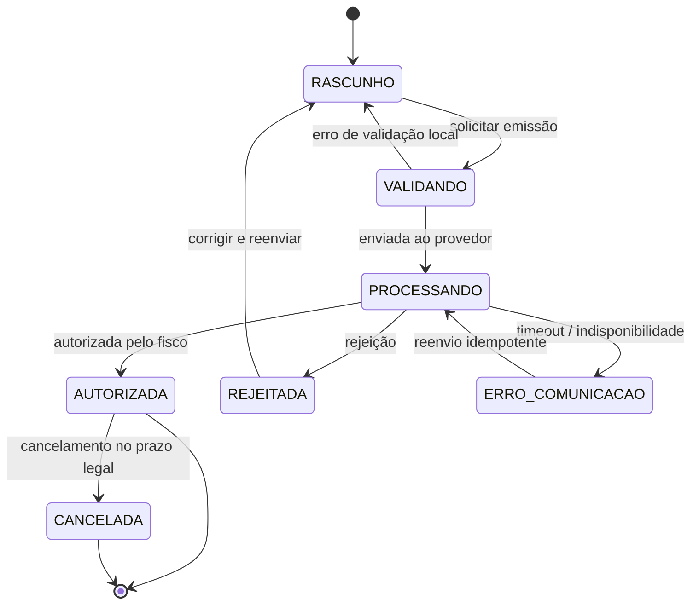

# 06 — Módulo Notas Fiscais

> **Decisão pendente P1.** A forma de emissão (provedor terceiro vs. SEFAZ direto) ainda não
> foi definida. Por isso este módulo é construído desde o início atrás de uma **interface
> de provedor** (ADR-005): o sistema inteiro é escrito uma vez e a decisão vira uma
> implementação plugável, não uma reescrita.

## 1. Os dois caminhos, com custo real

| Critério | Provedor terceiro (Focus NFe, PlugNotas, NFe.io) | SEFAZ direto |
|---|---|---|
| Esforço de implementação | ~1 sprint | ~4–6 sprints |
| Certificado digital | Enviado ao provedor | Gerenciado por você (A1 em cofre, renovação anual) |
| Assinatura XML e schemas | Provedor | Você (XMLDSig, XSD por versão de layout) |
| Contingência (SVC/offline) | Provedor | Você |
| Mudanças de layout da SEFAZ | Provedor absorve | Você acompanha e migra |
| NFS-e (municipal) | Cobertura ampla, um só contrato | Um padrão por município — inviável fazer sozinho |
| Custo | Mensalidade + por nota | Sem custo por nota, alto custo de manutenção |
| Risco operacional | Dependência de terceiro | Todo seu |

**Recomendação técnica:** provedor terceiro. A NFS-e sozinha já justifica — cada prefeitura
tem seu próprio webservice, e a Technoloife emite nota de serviço. O ganho de "não pagar por
nota" não compensa manter uma equipe acompanhando o calendário de mudanças da SEFAZ.
A decisão final, porém, é do negócio; o código não fica refém dela.

## 2. A interface de provedor

```ts
// apps/api/src/infra/fiscal/fiscal-provider.ts

export interface FiscalProvider {
  readonly nome: string;

  emitir(input: EmitirNotaInput): Promise<ResultadoEmissao>;
  consultar(ref: string): Promise<StatusNota>;
  cancelar(ref: string, motivo: string): Promise<ResultadoCancelamento>;
  cartaCorrecao(ref: string, texto: string): Promise<ResultadoEvento>;
  obterXml(ref: string): Promise<Buffer>;
  obterPdf(ref: string): Promise<Buffer>;
}

export type ResultadoEmissao =
  | { status: 'AUTORIZADA'; chave: string; numero: number; serie: number;
      protocolo: string; xml: Buffer; pdfUrl?: string }
  | { status: 'PROCESSANDO'; ref: string }
  | { status: 'REJEITADA'; codigo: string; mensagem: string };
```

### Implementações previstas

| Classe | Fase | Uso |
|---|---|---|
| `MockFiscalProvider` | Sprint 1 | Dev, testes e demonstração. Simula autorização, rejeição e cancelamento com latência configurável |
| `FocusNfeProvider` | Fase 3 | Se a decisão for provedor |
| `PlugNotasProvider` | Fase 3 | Alternativa |
| `SefazDiretoProvider` | Futuro | Só se P1 apontar emissão própria |

O resto do sistema — services, rotas, telas, relatórios — **não muda** entre elas.

## 3. Máquina de estados da nota



## 4. Regras de negócio

**RN-NF-01 — Composição da OS define os documentos.** OS com peças **e** serviços gera
**duas** notas: NF-e (modelo 55) para os produtos e NFS-e para os serviços. São documentos
de esferas diferentes (estadual e municipal) e não se fundem. As duas apontam para a mesma
`ordem_servico_id`.

**RN-NF-02 — Idempotência é obrigatória.** Toda emissão envia uma chave de idempotência
(`nota_fiscal.id`). Reenvio após timeout **consulta** pelo `provedor_ref` antes de emitir.
Nota duplicada no fisco é um problema caro e trabalhoso de desfazer.

**RN-NF-03 — Emissão é assíncrona.** A rota de emissão retorna `202 Accepted` e enfileira o
job. O front acompanha por polling ou SSE. Nenhuma requisição HTTP do usuário fica esperando
a SEFAZ.

**RN-NF-04 — Validação local antes do envio.** Antes de qualquer chamada externa, valida-se:
destinatário com documento e endereço completos (com código IBGE), todo item com NCM e CFOP,
código de serviço municipal nos serviços, valor total > 0, emitente configurado. Isso
transforma rejeição do fisco em erro de formulário — muito mais barato.

**RN-NF-05 — XML e PDF são imutáveis.** Armazenados em storage versionado, com retenção de
5 anos (requisito legal). O caminho fica em `notas_fiscais`; o arquivo nunca é sobrescrito.

**RN-NF-06 — Cancelamento tem prazo.** NF-e: até 24h após a autorização (regra geral,
varia por UF). Passado o prazo, o caminho é a **nota de devolução**. O sistema calcula e
exibe o prazo restante e bloqueia a tentativa fora dele com explicação.

**RN-NF-07 — Carta de correção não muda valores.** Permitida apenas para dados que não
alterem valores, partes envolvidas ou descrição da mercadoria. Máximo de 20 eventos por nota.

**RN-NF-08 — Nota autorizada gera financeiro.** Se a OS ainda não gerou títulos, a
autorização dispara a criação. Se já gerou (faturamento pela OS), a nota apenas se vincula.
Nunca duplicar títulos — verificação por `ordem_servico_id`.

**RN-NF-09 — Impostos são parametrizados, não hardcoded.** Alíquotas e CST/CSOSN vêm de
`parametros` + cadastro do produto/serviço, conforme o regime tributário da empresa (P2).

**RN-NF-10 — Todo evento fica registrado.** Envio, autorização, rejeição, cancelamento e
carta de correção geram linha em `nota_fiscal_eventos` com o payload completo. Quando o
contador perguntar "o que aconteceu com essa nota", a resposta está no sistema.

**RN-NF-11 — Rejeição é acionável.** Código e mensagem do fisco são exibidos junto de uma
tradução em linguagem clara e do campo que provavelmente causou o problema (dicionário dos
~30 erros mais comuns: 204 duplicidade, 539 chave já usada, 610 valor total divergente…).

**RN-NF-12 — Numeração é do provedor/série.** O sistema não inventa número de nota; ele é
atribuído na autorização. Antes disso, a referência é o `id` interno.

## 5. Fluxo de emissão

```
Usuário clica "Emitir NF" na OS
   │
   ▼
Monta RASCUNHO a partir da OS (itens, cliente, impostos)     ← síncrono
   │
   ▼
Validação local (RN-NF-04)
   ├─ falhou → 422 com lista de campos pendentes
   ▼
Persiste nota (status VALIDANDO → PROCESSANDO) + enfileira job
   │
   ▼  202 Accepted
[worker] FiscalProvider.emitir(payload, idempotencyKey)
   ├─ AUTORIZADA → salva chave, protocolo, XML, PDF
   │              → evento AUTORIZACAO → gera/vincula títulos (RN-NF-08)
   │              → notifica o front
   ├─ REJEITADA  → status REJEITADA + código/mensagem traduzidos
   └─ timeout    → ERRO_COMUNICACAO → retry com backoff (consulta antes de reenviar)
```

## 6. Notas de entrada (compras)

Além da emissão, o módulo registra **notas recebidas de fornecedores**: chave de acesso,
fornecedor, itens, valores. Serve para dar entrada no estoque (doc 04) e gerar contas a
pagar (doc 07). No MVP, o lançamento é manual; a importação por XML/chave entra na Fase 3.

## 7. Critérios de aceite (MVP com `MockFiscalProvider`)

- [ ] `FiscalProvider` definido e injetado por configuração (`FISCAL_PROVIDER=mock`).
- [ ] Rascunho de NF gerado a partir de uma OS, com itens e totais corretos.
- [ ] Validação local lista todos os campos pendentes de uma vez (não um por vez).
- [ ] Emissão retorna `202` e a nota transita para `AUTORIZADA` via job simulado.
- [ ] Rejeição simulada exibe código, mensagem traduzida e permite corrigir e reenviar.
- [ ] Reenvio após timeout não duplica a nota (teste de idempotência).
- [ ] Cancelamento dentro do prazo funciona; fora do prazo é bloqueado com explicação.
- [ ] Todos os eventos aparecem na linha do tempo da nota.
- [ ] Trocar de `mock` para outro provedor não exige mudança fora de `infra/fiscal/`.
