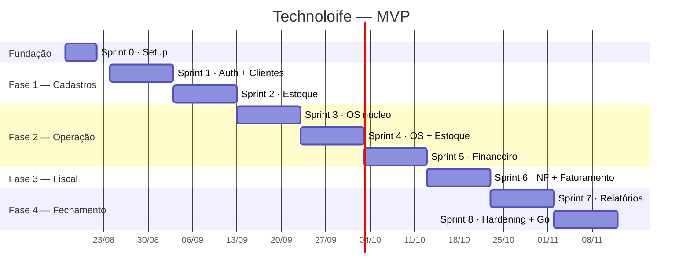

# 10 — Plano de Execução

Sprints de **2 semanas** (a Sprint 0 tem 1 semana). As datas assumem início em
**17/08/2026** e servem de referência — o que importa é a **ordem**, ditada por dependências
técnicas reais, não por preferência.

## 1. Princípio de sequenciamento

A ordem não é negociável em três pontos:

1. **Clientes antes de tudo** — OS, NF e títulos apontam para cliente.
2. **Estoque antes de OS** — a OS consome estoque; construir OS primeiro obrigaria a
   refazer a integração depois.
3. **Financeiro antes de Notas Fiscais** — a nota autorizada gera títulos. Sem financeiro
   pronto, o faturamento fica pela metade.

Notas Fiscais fica por último de propósito: é o módulo com a decisão pendente (P1) e o
único que depende de terceiros. Colocá-lo no fim dá o máximo de tempo para decidir sem
travar o cronograma.

## 2. Roadmap

---

## Sprint 0 — Fundação (17–21/08) · 1 semana

**Objetivo:** qualquer pessoa clona o repositório e tem o sistema rodando em um comando.

| # | Entregável |
|---|---|
| 0.1 | Monorepo pnpm + Turborepo, `apps/api`, `apps/web`, `packages/{contracts,shared,config}` |
| 0.2 | TypeScript strict, ESLint, Prettier, EditorConfig compartilhados |
| 0.3 | `docker-compose.yml` com Postgres 16 e Redis |
| 0.4 | Fastify iniciando com `/health`, logger pino, `X-Request-Id` |
| 0.5 | Prisma conectado, primeira migration, `pnpm db:seed` |
| 0.6 | Envelope de erro, paginação, helpers de dinheiro em `shared` |
| 0.7 | Next.js com layout base, Tailwind, shadcn/ui, tela de login estática |
| 0.8 | Vitest configurado (unidade + integração com Testcontainers) |
| 0.9 | GitHub Actions: lint + typecheck + testes em cada PR |
| 0.10 | `README` de setup e `.env.example` |

**Aceite:** `pnpm i && docker compose up -d && pnpm db:migrate && pnpm db:seed && pnpm dev`
sobe API e web funcionando. CI verde no primeiro PR.

---

## Sprint 1 — Autenticação e Clientes (24/08–04/09)

| # | Entregável | Doc |
|---|---|---|
| 1.1 | Modelo `usuarios`, hash Argon2, seed do admin | 09 |
| 1.2 | Login, refresh rotativo, logout, `/auth/me` | 09 |
| 1.3 | Middleware `autenticar` + `exigirPermissao`, matriz de papéis | 09 |
| 1.4 | Tabela e serviço de auditoria (transversal) | 09 |
| 1.5 | CRUD de clientes com validação de CPF/CNPJ | 03 |
| 1.6 | Endereços, contatos, equipamentos | 03 |
| 1.7 | Busca com `unaccent` + `pg_trgm` | 03 |
| 1.8 | Bloqueio/inativação, aba de histórico (estrutura) | 03 |
| 1.9 | Web: login, listagem, formulário e ficha do cliente | 03 |
| 1.10 | OpenAPI publicado em `/docs` | 08 |

**Aceite:** critérios do doc 03 + login seguro com rotação de refresh testada.
**Risco:** subestimar o formulário de cliente (PF/PJ, múltiplos endereços). Mitigação: fazer
o formulário completo nesta sprint e não voltar nele.

---

## Sprint 2 — Estoque (07–18/09)

| # | Entregável | Doc |
|---|---|---|
| 2.1 | Modelos: produtos, categorias, fornecedores, movimentos, reservas | 02 |
| 2.2 | Serviço de movimentação transacional com `FOR UPDATE` | 04 |
| 2.3 | Custo médio ponderado (RN-EST-03) com testes de borda | 04 |
| 2.4 | Entrada de compra multi-item | 04 |
| 2.5 | Ajuste, perda e devolução com motivo | 04 |
| 2.6 | API de reserva/liberação/consumo (usada pela OS na Sprint 4) | 04 |
| 2.7 | Kardex e alertas de estoque mínimo | 04 |
| 2.8 | Inventário: abrir, contar, fechar com ajustes | 04 |
| 2.9 | Job noturno de conferência de saldo | 04 |
| 2.10 | Web: produtos, entrada, kardex, alertas | 04 |

**Aceite:** critérios do doc 04, incluindo o **teste de concorrência** de duas baixas
simultâneas do último item.
**Risco:** custo médio implementado errado corrompe todo o histórico. Mitigação: escrever os
testes da fórmula **antes** da implementação, com casos de saldo zero e quantidades fracionárias.

---

## Sprint 3 — Ordem de Serviço, núcleo (21/09–02/10)

| # | Entregável | Doc |
|---|---|---|
| 3.1 | Modelos: OS, itens, apontamentos, histórico, anexos, serviços | 02 |
| 3.2 | Máquina de estados com validação centralizada de transições | 05 |
| 3.3 | Abertura, atribuição de técnico, diagnóstico | 05 |
| 3.4 | Itens com snapshot de preço e custo; recálculo de totais | 05 |
| 3.5 | Desconto com limite por papel | 05 |
| 3.6 | Aprovação/reprovação com registro de quem aprovou | 05 |
| 3.7 | Apontamento de horas e upload de anexos | 05 |
| 3.8 | Web: kanban, ficha da OS, lançamento de itens | 05 |
| 3.9 | Catálogo de serviços | 05 |

**Aceite:** OS percorre `ABERTA → … → ENTREGUE` com histórico completo; transições inválidas
bloqueadas.
**Risco:** regra de estado espalhada pelo código. Mitigação: uma única função
`podeTransicionar(de, para, contexto)` — testada isoladamente, usada por todos.

---

## Sprint 4 — OS × Estoque e documentos (05–16/10)

| # | Entregável | Doc |
|---|---|---|
| 4.1 | Reserva automática na aprovação (RN-OS-06) | 05 |
| 4.2 | Baixa automática na conclusão (RN-OS-07), transacional | 05 |
| 4.3 | Estorno no cancelamento nos dois cenários (RN-OS-09) | 05 |
| 4.4 | Status `AGUARDANDO_PECA` e visibilidade de pendências | 05 |
| 4.5 | Geração de PDF: entrada, orçamento, execução, entrega | 05 |
| 4.6 | Cálculo de margem da OS | 05 |
| 4.7 | Garantia e OS vinculada (RN-OS-11) | 05 |
| 4.8 | Event bus interno + eventos de domínio | 01 |
| 4.9 | Testes de integração ponta a ponta OS↔Estoque | 04/05 |

**Aceite:** ciclo completo aprovar → reservar → concluir → baixar → cancelar → estornar,
com o kardex batendo com o saldo ao final.
**Risco:** maior ponto de acoplamento do sistema. Mitigação: sprint dedicada só a isso, sem
funcionalidade nova concorrente.

---

## Sprint 5 — Financeiro (19–30/10)

| # | Entregável | Doc |
|---|---|---|
| 5.1 | Modelos: títulos, baixas, contas, categorias, formas, movimentos de caixa | 02 |
| 5.2 | Geração de títulos com parcelamento e distribuição de centavos | 07 |
| 5.3 | Baixa total e parcial com juros/multa/desconto | 07 |
| 5.4 | Estorno de baixa | 07 |
| 5.5 | Movimentos de caixa e extrato por conta | 07 |
| 5.6 | Taxa de cartão e prazo de compensação | 07 |
| 5.7 | Faturamento da OS gerando títulos (sem NF ainda) | 05/07 |
| 5.8 | Contas a pagar a partir de entrada de compra | 04/07 |
| 5.9 | Fechamento de caixa | 07 |
| 5.10 | Web: contas a receber/pagar, tela de baixa, extrato | 07 |

**Aceite:** critérios do doc 07, com destaque para `Σ parcelas = valor_total` exato.
**Risco:** arredondamento. Mitigação: `Decimal` em toda a cadeia + teste com valores
propositalmente indivisíveis (100/3, 0,01/3, 999,99/7).

---

## Sprint 6 — Notas Fiscais e faturamento completo (02–13/11)

| # | Entregável | Doc |
|---|---|---|
| 6.1 | Interface `FiscalProvider` + `MockFiscalProvider` | 06 |
| 6.2 | Modelos: notas, itens, eventos | 02 |
| 6.3 | Rascunho a partir da OS com cálculo de impostos parametrizado | 06 |
| 6.4 | Validação local com lista completa de pendências | 06 |
| 6.5 | Emissão assíncrona (BullMQ) com idempotência e retry | 06 |
| 6.6 | Máquina de estados fiscal + linha do tempo de eventos | 06 |
| 6.7 | Cancelamento com validação de prazo e carta de correção | 06 |
| 6.8 | Vínculo NF ↔ títulos sem duplicação (RN-NF-08) | 06/07 |
| 6.9 | Registro de NF de entrada (fornecedor) | 06 |
| 6.10 | Web: lista de notas, emissão, acompanhamento, download | 06 |

**Aceite:** critérios do doc 06 com o provedor mock.
**Decisão necessária até o início desta sprint: P1 e P2.**
**Risco:** decisão de provedor atrasa. Mitigação: a sprint entrega tudo com o mock — a
integração real vira um item isolado da Fase 3, de ~1 sprint, sem mexer no resto.

---

## Sprint 7 — Relatórios e dashboards (16–27/11)

| # | Entregável | Doc |
|---|---|---|
| 7.1 | Dashboard por papel | 00 |
| 7.2 | Relatórios de estoque: posição, valorização, curva ABC | 04 |
| 7.3 | Relatórios de OS: produtividade por técnico, tempo médio, rentabilidade | 05 |
| 7.4 | Relatórios financeiros: fluxo realizado e projetado, inadimplência, DRE | 07 |
| 7.5 | Export CSV/PDF de todos os relatórios | 08 |
| 7.6 | Índices e otimização de consultas (EXPLAIN nas pesadas) | 01 |
| 7.7 | Tela de auditoria (ADMIN) | 09 |
| 7.8 | Tela de parâmetros do sistema | 01 |

**Aceite:** todo relatório abre em < 1 s com massa de 12 meses (≈ 12 mil OS, 40 mil títulos).

---

## Sprint 8 — Hardening e go-live (30/11–11/12)

| # | Entregável |
|---|---|
| 8.1 | Suíte E2E (Playwright) dos 5 fluxos críticos |
| 8.2 | Cobertura ≥ 80% nos services de estoque, OS e financeiro |
| 8.3 | Revisão de segurança contra a checklist do doc 09 |
| 8.4 | Teste de carga (k6): 50 usuários simultâneos |
| 8.5 | Backup automatizado + **restauração testada** |
| 8.6 | Observabilidade: logs estruturados, métricas, alertas |
| 8.7 | Pipeline de deploy staging → produção |
| 8.8 | Importação dos dados atuais (clientes, produtos, saldos, títulos em aberto) |
| 8.9 | Treinamento por papel + manual do usuário |
| 8.10 | Operação assistida na primeira semana |

**Aceite:** sistema em produção com dados reais e nenhum bug crítico aberto.

---

## 3. Depois do MVP

| Fase | Escopo | Estimativa |
|---|---|---|
| **F3.1** | Integração fiscal real (decisão P1) + homologação | 1–2 sprints |
| **F3.2** | Importação de NF de entrada por XML/chave | 1 sprint |
| **F3.3** | Integração bancária: boleto, Pix, conciliação OFX/CNAB | 2–3 sprints |
| **F4.1** | Portal do cliente (acompanhar OS, aprovar orçamento, 2ª via) | 2 sprints |
| **F4.2** | Notificações WhatsApp/e-mail (orçamento, conclusão, cobrança) | 1–2 sprints |
| **F4.3** | App mobile do técnico (offline-first) | 3–4 sprints |
| **F4.4** | LGPD: export e anonimização self-service | 1 sprint |
| **F4.5** | BI: metas, comissão de técnico, previsão de demanda | 2 sprints |

## 4. Riscos do projeto

| Risco | Prob. | Impacto | Mitigação |
|---|---|---|---|
| Decisão fiscal (P1) atrasa | Alta | Médio | Arquitetura com provedor abstrato; MVP roda com mock |
| Regime tributário (P2) indefinido | Média | Médio | Alíquotas em `parametros`, não em código |
| Escopo cresce durante o desenvolvimento | Alta | Alto | Backlog congelado por sprint; novidade entra na Fase 3+ |
| Qualidade dos dados atuais para migração | Alta | Médio | Levantar e limpar a base já na Sprint 1, não na 8 |
| Bug de arredondamento em produção | Média | Alto | `Decimal` obrigatório + testes de invariante |
| Estoque divergente do físico | Média | Alto | Job de conferência + inventário desde a Sprint 2 |
| Adoção pela equipe | Média | Alto | Treinamento por papel e operação assistida na Sprint 8 |
| Dependência de uma só pessoa no código | Média | Alto | Revisão de PR obrigatória, documentação viva neste repositório |

## 5. Definição de pronto (DoD)

Um item só está pronto quando:

- [ ] Regra de negócio implementada no *service*, não na rota nem na tela
- [ ] Schema Zod de entrada e saída, com `.strict()`
- [ ] Testes de unidade das regras + integração da rota
- [ ] Permissão declarada na rota e refletida na matriz do doc 09
- [ ] Auditoria registrada, quando a ação for auditável
- [ ] Migration versionada e revisada
- [ ] OpenAPI atualizado
- [ ] Tela funcional, responsiva, com estados de carregando/vazio/erro
- [ ] Documentação do módulo atualizada se a regra mudou
- [ ] PR revisado e CI verde
